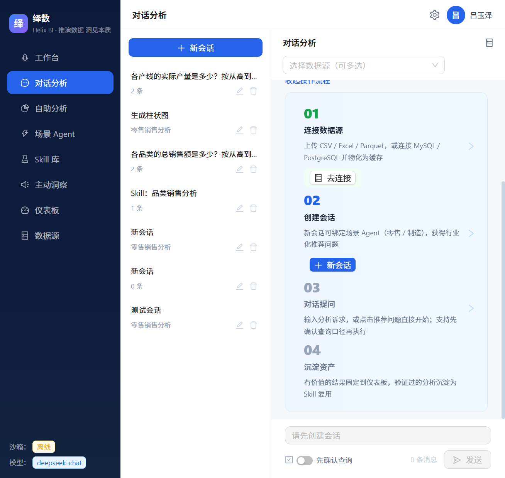
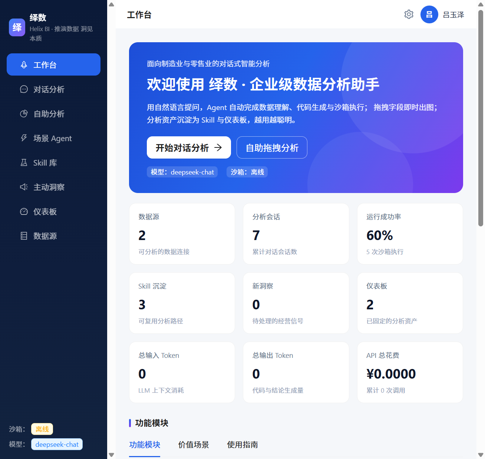
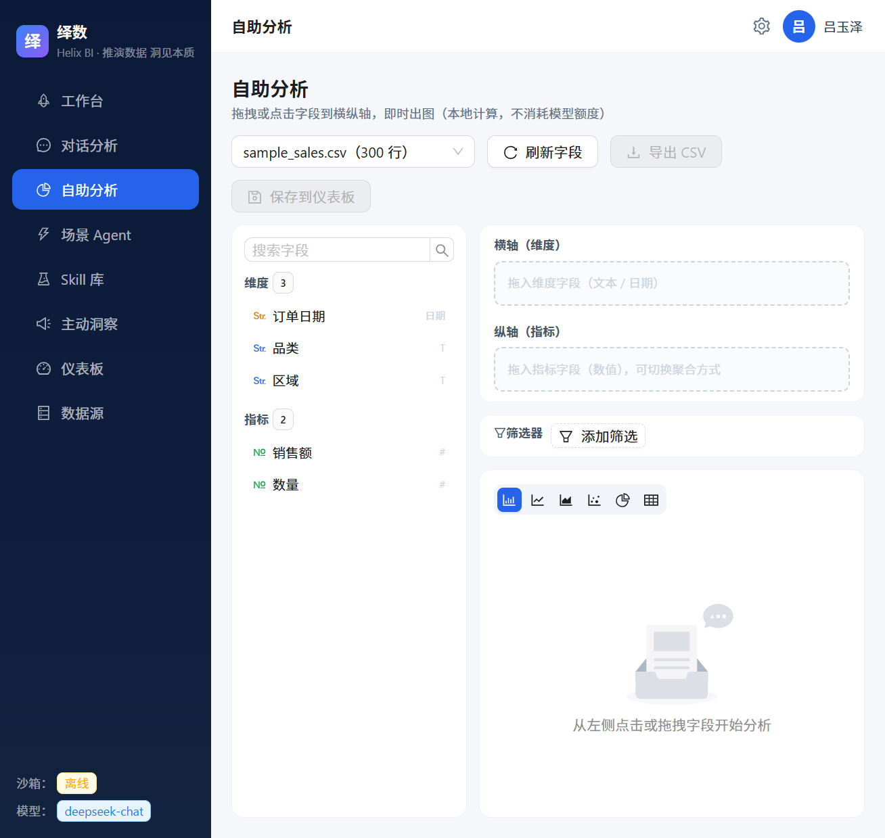
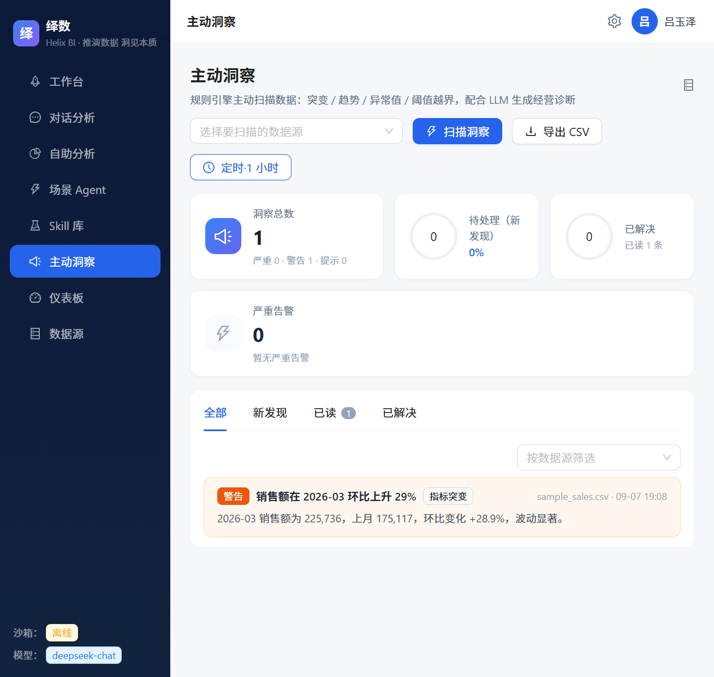
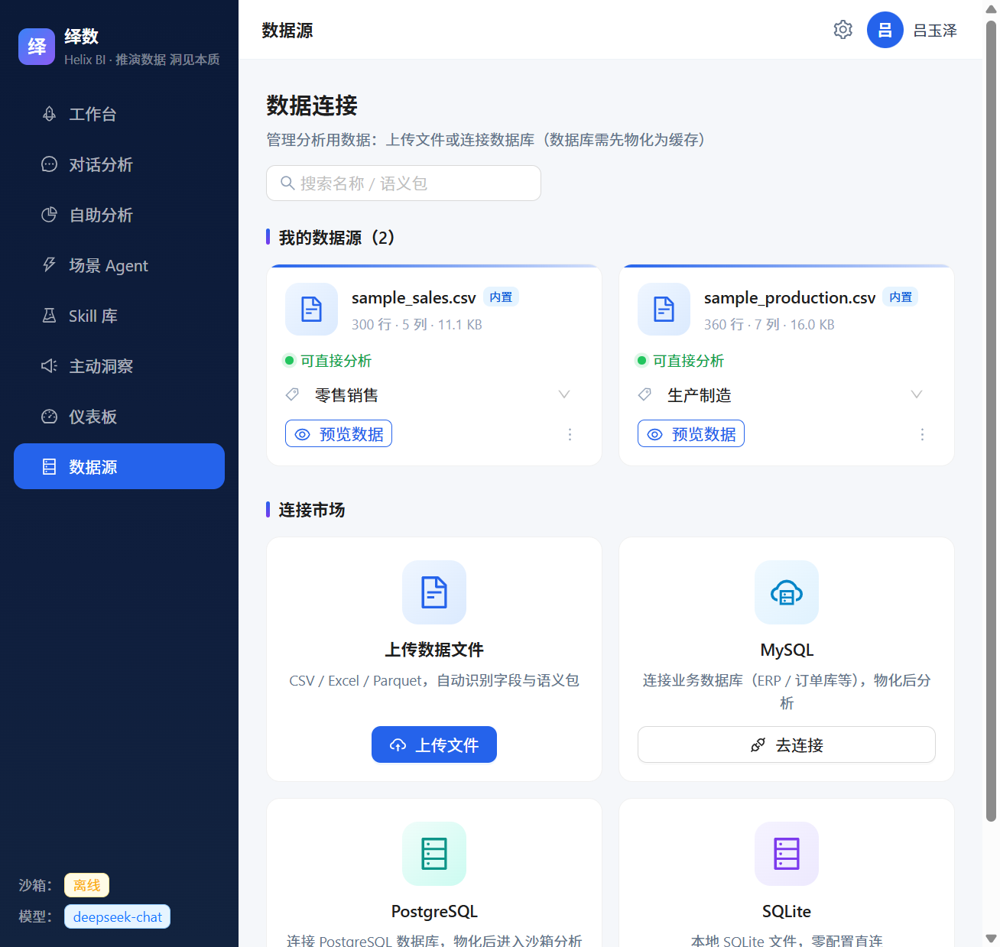

<div align="center">

# 绎数 · Helix BI

**面向制造业与零售业的对话式 AgentBI**

自然语言提问 → Agent 生成分析代码 → Docker 沙箱安全执行 → 图表 / 表格 / 结论，
分析资产自动沉淀为 Skill、洞察与仪表板，**越用越聪明**。

[快速开始](#快速开始) · [核心特性](#核心特性) · [架构](#架构) · [技术栈](#技术栈) · [Roadmap](#roadmap)

</div>

---

## 这是什么？

绎数（Helix BI）是一个开源的企业级数据分析 Agent 工作台。它把「对话式分析」和「传统 BI 资产沉淀」放在同一条链路上：

```
连接数据（文件 / 数据库）→ 对话提问（可选口径确认）
  → SSE 流式分析（Skill 命中秒级重放 / 未命中 LLM 生成 + 失败自修复）
  → 结论 + 图表 + 表格 + 追问
  → 沉淀为 Skill / 固定到仪表板
  → 定时洞察扫描 → LLM 经营诊断 → 仪表板 → 导出报告
```

内置**零售销售**与**生产制造**两个行业语义包（指标口径、派生公式、同义词、时间口径），也随时可以接自己的数据。

## 界面预览

| 对话分析（Agent 流式执行） | 工作台 |
|:---:|:---:|
|  |  |

| 自助分析（拖拽零 token 出图） | 主动洞察（定时扫描 + 概览） |
|:---:|:---:|
|  |  |

| 数据源管理（上传 / 数据库 / SQL 查询） |
|:---:|
|  |

## 核心特性

| 模块 | 能力 |
| --- | --- |
| **对话分析** | 自然语言提问，SSE 流式展示步骤进度 / 代码 / 终端 / 图表 / 表格 / 结论；「先确认查询」模式可人工编辑 QuerySpec 再执行；失败自动修复重试（最多 3 次）；推荐追问一键续问 |
| **自助分析** | 点击 / 拖拽字段即时出图（ECharts 交互渲染，本地计算零 token）；柱 / 线 / 饼 / 面 / 散点 / 堆叠等图表类型随时切换；聚合方式与排序可调 |
| **场景 Agent** | 预置零售销售 / 生产制造行业专家：绑定语义包与数据源、开场白、推荐问题、启停管理，开箱即聊 |
| **Skill 库** | 验证过的分析路径自动沉淀为可复用 Skill；相似问题直接重放代码（秒回）；列结构变化时作为 few-shot 参考重新生成；使用 / 成功率统计 |
| **主动洞察** | 定时扫描全部数据源：指标突变 / 连续趋势 / 异常值 / 头部份额变化 / 阈值越界（自动剔除残月避免误报）；新告警 LLM 自动诊断（现象 → 证据 → 原因 → 建议）；概览统计卡 + 状态流转 |
| **仪表板** | 对话中的图表 / 表格 / 结论、洞察诊断一键固定；网格布局浏览；导出自包含 HTML 报告 |
| **数据源** | CSV / Excel / Parquet 上传；MySQL / PostgreSQL / SQLite 连接（先测试后保存）；DB 表物化为 parquet 缓存后进沙箱；数据预览 + **只读 SQL 查询**（本地 sqlite 执行，零 token） |
| **语义层** | 行业语义包定义指标（含派生公式：良率、达成率、客单价等）、维度、同义词、时间口径、图表建议，注入生成 prompt 保证口径一致 |
| **设置中心** | LLM 接口热更新（DeepSeek / 智谱 / 通义 / OpenAI 兼容接口，保存即生效）；偏好设置（回答风格 / 创意度 / 追问开关 / 自定义指令）；个人资料 |
| **可靠性** | 沙箱无网络 + CPU / 内存限制 + 数据只读；`dahelper` JSON 契约回传；SQLite 元数据库 WAL 模式 |

## 架构

```
┌──────────────── React 18 + AntD 5 前端（Vite） ────────────────┐
│ 工作台 / 对话分析 / 自助分析 / 场景Agent / Skill库 /            │
│ 主动洞察 / 仪表板 / 数据源 / 设置中心                            │
└───────────────────────────┬───────────────────────────────────┘
                    SSE 流式（spec/code/step/answer/chart…）
┌───────────────────────────▼───────────────────────────────────┐
│                     FastAPI 后端（:8000）                       │
│  routers/   analysis(SSE) sessions datasources agents skills   │
│             insights dashboards explore(SQL) settings usage    │
│  services/  analysis_runner  # LangGraph 包装 + 运行持久化       │
│             skill_engine    # 沉淀 / 匹配 / 重放 / few-shot      │
│             insight_engine  # 规则扫描 + LLM 诊断                │
│             insight_scheduler # 定时扫描后台循环                  │
│             datasource      # 文件 + DB 连接 + parquet 物化      │
│  semantic/  行业语义包（零售销售 / 生产制造）                      │
│  SQLite 元数据库（WAL）：会话/消息/运行/数据源/Agent/Skill/       │
│                         洞察/仪表板/系统设置/Token用量            │
└───────────────────────────┬───────────────────────────────────┘
                            ▼
             LangGraph 内核（parse_intent → generate_code
               → execute → 自修复循环 → summarize → followup）
                            ▼
         Docker 沙箱：--network none、CPU/内存限制、/data 只读
         文件型数据源直接挂载；数据库数据先物化为 parquet 再进沙箱
```

## 快速开始

### 前置要求

- Python 3.11+
- Node.js 18+（仅开发前端需要；生产模式用后端托管的构建产物）
- Docker Desktop（沙箱执行需要；离线时分析/Skill 重放不可用，其余页面正常）

### 1. 后端

```bash
git clone https://github.com/<你的用户名>/helix-bi.git
cd helix-bi

python -m venv .venv
.venv\Scripts\pip install -r requirements.txt    # Linux/macOS: source .venv/bin/activate
copy .env.example .env                           # 填 OPENAI_BASE_URL / OPENAI_API_KEY / MODEL_NAME
```

`.env` 支持任何 OpenAI 兼容接口（DeepSeek / 智谱 GLM / 通义千问 / 本地 vLLM…），也可以启动后在页面右上角「设置中心」里在线配置（保存即生效，无需重启）：

```ini
OPENAI_BASE_URL=https://api.deepseek.com
OPENAI_API_KEY=sk-xxx
MODEL_NAME=deepseek-chat
```

### 2. 沙箱镜像

```bash
# Docker Desktop 运行中；Hub 不可直连时可先从镜像源拉
docker pull docker.m.daocloud.io/library/python:3.11-slim
docker tag docker.m.daocloud.io/library/python:3.11-slim python:3.11-slim
docker build -t daa-sandbox:latest sandbox/
```

### 3. 启动

```bash
.venv\Scripts\python -m uvicorn backend.main:app --port 8000
```

打开 <http://127.0.0.1:8000> 即可使用（内置示例数据源 / 场景 Agent / Skill）。

前端开发模式：

```bash
cd frontend && npm install && npm run dev   # http://localhost:5173（已配代理到 8000）
```

生产部署只需 `npm run build`，产物由后端静态托管。

## 目录结构

```
backend/                # FastAPI 服务
  main.py               # 入口（CORS / 静态托管 / lifespan）
  models.py schemas.py  # ORM（元数据表）与 API 模型
  seed.py               # 内置数据源 / Agent / Skill / 仪表板
  routers/              # analysis sessions datasources agents skills
                        # insights dashboards explore settings usage misc
  services/             # analysis_runner skill_engine insight_engine
                        # insight_scheduler datasource report_export
semantics/              # 行业语义包（retail_sales / manufacturing_production yaml）
app/                    # LangGraph 内核
  graph.py profiler.py sandbox.py prompts.py
sandbox/                # 沙箱镜像（pandas/pyarrow/matplotlib/中文字体 + dahelper）
frontend/               # React + AntD + Zustand + Vite
  src/pages/            # Chat Workbench Explore Agents Skills Insights
                        # Dashboards Datasources Usage
  src/stores/           # chatStore（SSE 状态机） appStore
examples/               # 示例数据（零售 / 生产 CSV）
screenshots/            # README 截图
uploads/ data/ runs/    # 运行期目录（gitignore）
```

## 技术栈

| 层 | 技术 |
| --- | --- |
| 前端 | React 18 · Ant Design 5 · Zustand · ECharts · Vite |
| 后端 | FastAPI · SQLAlchemy · SSE |
| Agent 内核 | LangGraph · LangChain（OpenAI 兼容接口） |
| 执行 | Docker 沙箱（无网络、资源限制、数据只读） · pandas / pyarrow / matplotlib |
| 元数据 | SQLite（WAL 模式） |
| 数据接入 | CSV / Excel / Parquet 文件 · MySQL / PostgreSQL / SQLAlchemy（物化为 parquet） |

## 设计思路

- **口径先行**：行业语义包 + QuerySpec 确认，先对齐「算什么」再写代码，避免 LLM 自由发挥导致口径漂移
- **沙箱兜底**：生成的代码永远在无网络 Docker 容器里跑，数据只读，结果通过 `dahelper` JSON 契约回传
- **资产沉淀**：一次成功的分析变成 Skill（重放秒回）、一次有价值的发现固定到仪表板——系统随使用变强，而不是每次从零开始
- **主动而非被动**：定时洞察扫描让系统在用户提问之前就把异常送到眼前
- **Token 可控**：Skill 重放不调 LLM；自助分析与 SQL 查询全部本地计算；追问推荐可关闭；测试连接只发 max_tokens=1 的探针请求

灵感来自 FineBI NEXT 的产品形态，以及 DB-GPT / PandasAI / Vanna / OpenCodeInterpreter 等开源项目在代码解释执行、自修复、追问推荐上的实践。

## Roadmap

- **R2**：仪表板图表前端化（ECharts 交互渲染替代 PNG）、洞察订阅推送、多用户与权限
- **R3**：评估集回归（固定问题集测准确率）、语义包可视化编辑器、指标血缘

## License

[MIT](LICENSE) © 2026 Helix BI Contributors
